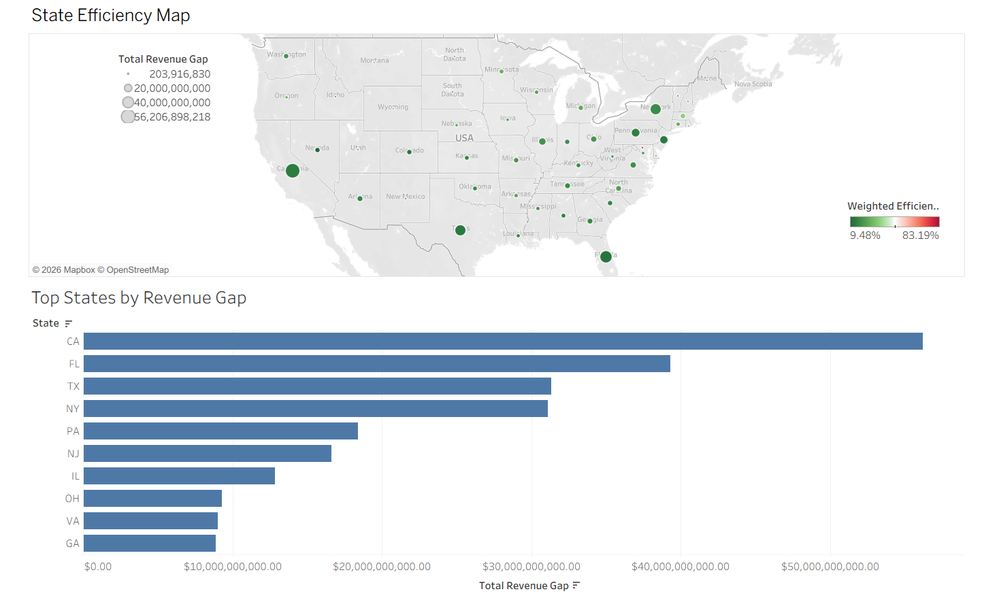
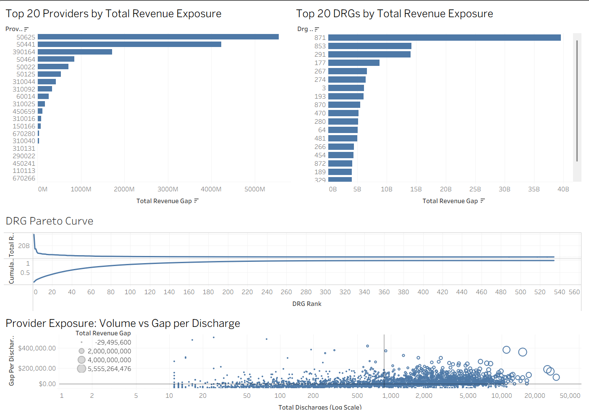
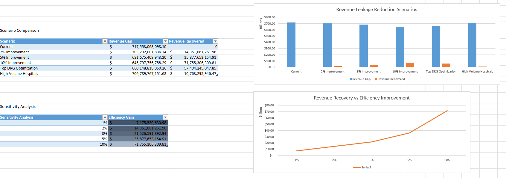
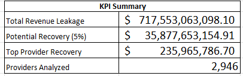

# Healthcare Revenue Decision Support
### Identifying Revenue Leakage and Modeling Recovery Opportunities in Medicare Hospital Billing

## Executive Summary

Healthcare providers often bill substantially higher amounts for inpatient services than what Medicare ultimately reimburses. This creates a large financial gap between submitted charges and actual payment received. While such differences are expected to some extent under reimbursement systems, persistent and large-scale gaps may signal operational inefficiencies, service-level billing challenges, or structural reimbursement pressure.

This project analyzes Medicare inpatient provider-service data to quantify these revenue gaps, identify the providers and services contributing the most financial exposure, visualize patterns across the United States, and estimate how much revenue could potentially be recovered under different operational improvement strategies.

Using a combination of **Python, SQL, Tableau, and Excel**, this project builds an end-to-end decision-support workflow that moves from raw billing data to strategic financial recommendations.

---

## Business Problem

Hospitals and healthcare systems operate under constant financial pressure. One important source of financial strain is the difference between what providers charge for services and what payers, such as Medicare, actually reimburse.

From a business perspective, this raises several important questions:

- Where are the largest financial gaps occurring?
- Which services create the highest exposure?
- Which hospitals contribute most to total unrecovered revenue?
- Are these inefficiencies concentrated in specific states or regions?
- How much revenue could be recovered through operational improvements?

This project addresses those questions by quantifying **revenue leakage exposure** and developing a framework for evaluating potential recovery strategies.

---

## Business Questions Answered

This project was designed to answer the following business questions:

1. **Where are the largest financial gaps between hospital charges and Medicare reimbursements?**  
   This identifies the scale of potential revenue leakage.

2. **Which inpatient services (DRGs) contribute the most to financial exposure?**  
   This highlights whether certain service lines create disproportionate reimbursement pressure.

3. **Which providers contribute the most total revenue gap when patient volume is considered?**  
   This helps distinguish between isolated inefficiency and large-scale operational exposure.

4. **How does payment efficiency vary by geography?**  
   This reveals state-level patterns in reimbursement efficiency and revenue exposure.

5. **How much revenue could be recovered under different operational improvement scenarios?**  
   This converts descriptive analysis into decision-support modeling.

---

## Project Objectives

The main objectives of this project were to:

- quantify the difference between submitted charges and Medicare payments
- identify high-risk providers, services, and states
- visualize concentration of financial exposure
- distinguish between high-volume and high-intensity revenue leakage
- build a financial scenario model to estimate revenue recovery potential
- provide business recommendations based on the results

---

## Dataset

**Source:** CMS Medicare Inpatient Provider Service Data

The dataset includes hospital-level inpatient billing and reimbursement records across the United States. It contains information such as:

- provider identifiers
- hospital names and locations
- state and geographic information
- Diagnosis Related Groups (DRGs)
- total discharges
- average submitted covered charges
- average Medicare payment amounts

This data provides a nationwide view of reimbursement patterns and potential revenue exposure.

---

## Tools and Technologies Used

This project was implemented using the following tools:

- **Python**
  - pandas
  - NumPy
  - matplotlib
- **SQL / MySQL**
- **Tableau**
- **Microsoft Excel**
- **GitHub**

Each tool served a different role in the project:

- **Python** was used for data cleaning, feature engineering, and export of processed datasets
- **SQL** was used to aggregate provider, DRG, and state-level metrics
- **Tableau** was used to build executive-style dashboards and visual analytics
- **Excel** was used to create a financial scenario model and sensitivity analysis
- **GitHub** was used to organize and present the final project

---

## Project Workflow

The project was completed in four major stages.

### 1. Data Preparation in Python

The raw CMS dataset was imported into Python and cleaned for analysis.

The following preprocessing steps were performed:

- loaded the raw Medicare inpatient dataset
- standardized column names
- renamed key business fields for readability
- inspected missing values and data quality
- explored distributions of charges, payments, and discharges
- prepared processed data for downstream SQL and Tableau analysis

### 2. Feature Engineering

Several important business metrics were created to make the data analytically useful.

These included:

**Payment Efficiency**  
Measures the share of submitted charges that is reimbursed by Medicare.

\[
\text{Payment Efficiency} = \frac{\text{Average Medicare Payment}}{\text{Average Submitted Charge}}
\]

**Revenue Gap per Discharge**  
Measures the difference between billed charges and reimbursement per case.

\[
\text{Revenue Gap per Discharge} = \text{Average Submitted Charge} - \text{Average Medicare Payment}
\]

**Revenue Leakage Percentage**  
Measures the proportion of submitted charges not recovered through Medicare reimbursement.

**Total Revenue Gap**  
Measures the total provider-service financial exposure after accounting for patient volume.

\[
\text{Total Revenue Gap} = \text{Revenue Gap per Discharge} \times \text{Total Discharges}
\]

These metrics transformed raw billing data into a business-oriented analytical dataset.

---

### 3. SQL-Based Aggregation and Analysis

The processed data was loaded into MySQL and analyzed using SQL queries.

SQL scripts were created to aggregate financial exposure across different business dimensions:

- provider-level exposure analysis
- DRG-level exposure analysis
- state-level summary analysis
- Tableau-ready summary tables and views

This allowed the project to answer questions such as:

- Which providers generate the highest total revenue gap?
- Which DRGs create the largest financial exposure?
- How concentrated is the revenue gap problem?
- Which states have the highest total exposure and lowest efficiency?

---

### 4. Visualization in Tableau

A set of dashboards was created in Tableau to communicate findings visually.

The Tableau outputs include:

#### Top Providers by Total Revenue Exposure
Shows which providers contribute the most total revenue gap.

#### Top DRGs by Total Revenue Exposure
Highlights which inpatient services create the greatest reimbursement gap.

#### DRG Pareto Curve
Shows that a relatively small number of DRGs account for a large share of the total revenue exposure.

#### Provider Exposure: Volume vs Gap per Discharge
Distinguishes between:
- providers with high volume-driven exposure
- providers with high gap-per-discharge intensity

#### State Efficiency Map
Displays payment efficiency and revenue gap across states.

#### Top States by Revenue Gap
Ranks states by total financial exposure.

These dashboards were designed to provide both executive-level summary insight and operational drill-down capability.

---

## Tableau Dashboard Outputs

### Geographic Dashboard


### Provider and DRG Exposure Dashboard


---

## Financial Scenario Modeling in Excel

To move beyond descriptive analytics, an Excel-based financial scenario model was built.

This model estimates how much revenue could potentially be recovered under different strategic interventions.

The model includes:

- scenario assumptions
- baseline financial metrics
- KPI summary
- scenario comparison table
- strategy comparison chart
- sensitivity analysis
- revenue recovery curve

---

## Scenario Inputs

The following assumptions were used in the financial model:

- **System-wide efficiency gain:** 5%
- **Target providers:** top 20 high-leakage providers
- **Target provider efficiency gain:** 10%
- **Target DRG improvement:** 8%
- **Top DRGs considered:** 10
- **High-volume provider share:** 30%
- **High-volume efficiency gain:** 5%

These inputs were used to simulate alternative revenue recovery strategies.

---

## Financial Scenarios Modeled

### Scenario 1 — System-wide Efficiency Improvement
Assumes all providers improve payment efficiency by 5%.

This models the potential effect of broad operational improvements across the healthcare system.

**Estimated recovery:** approximately **$35.9B**

---

### Scenario 2 — Target High-Leakage Providers
Focuses on the providers contributing the highest total revenue gap.

This models a targeted intervention strategy aimed at the most financially exposed providers.

**Estimated recovery:** approximately **$236M**

---

### Scenario 3 — Top DRG Optimization
Targets the highest-exposure inpatient services (DRGs).

This models the financial effect of improving coding, billing, or reimbursement efficiency in the most impactful service lines.

**Estimated recovery:** approximately **$57.4B**

---

### Scenario 4 — High-Volume Hospital Strategy
Targets providers with large patient volumes.

This models the financial effect of improving efficiency among high-volume hospitals, which contribute large total exposure even if their gap per discharge is moderate.

**Estimated recovery:** approximately **$10.8B**

---

### Sensitivity Analysis
A sensitivity model was also built to measure how total recovery changes as efficiency improvements increase.

For example:

| Efficiency Improvement | Estimated Revenue Recovery |
|---|---:|
| 1% | ~$7.2B |
| 2% | ~$14.4B |
| 3% | ~$21.5B |
| 5% | ~$35.9B |
| 10% | ~$71.8B |

This analysis demonstrates that even small improvements in payment efficiency can produce large financial gains.

---

## Excel Scenario Model Output





---

## Key Insights

The analysis produced several important business insights:

- The total estimated revenue gap across analyzed providers is approximately **$717.6B**, highlighting the scale of unrecovered financial exposure in the dataset.
- Revenue leakage is **highly concentrated**, with a relatively small number of providers and DRGs accounting for a disproportionate share of total exposure.
- Geographic variation is substantial, with certain states contributing significantly more total revenue gap than others.
- High-volume hospitals contribute a large share of total exposure, even when their revenue gap per discharge is not the highest.
- DRG-level optimization appears to offer one of the strongest targeted recovery opportunities.
- Sensitivity analysis shows that even a **1% efficiency improvement could recover more than $7B**, indicating that operational improvements have high financial leverage.

---

## Business Recommendations

Based on the analysis, healthcare administrators and finance teams could consider the following actions:

### 1. Prioritize High-Impact DRGs
A small number of DRGs account for a large portion of total revenue gap. Improving coding quality, reimbursement workflow, and service-line efficiency for these DRGs could yield significant financial benefit.

### 2. Target High-Leakage Providers
Rather than attempting to optimize all providers at once, organizations could prioritize the hospitals contributing the highest total exposure.

### 3. Focus on High-Volume Hospitals
Because high-volume hospitals scale financial inefficiency across many cases, targeted process improvements in these facilities may generate substantial recovery.

### 4. Monitor Payment Efficiency as a KPI
Payment efficiency can serve as a practical operational metric for identifying reimbursement problems, benchmarking providers, and guiding intervention priorities.

### 5. Use Scenario Modeling in Strategic Planning
Financial scenario models can help leadership estimate the return of operational improvements and compare alternative intervention strategies before implementation.

---

## Strategic Impact

This project demonstrates how healthcare financial data can be transformed into a practical **decision-support framework**.

Instead of simply describing where the problem exists, the analysis helps answer:

- where revenue leakage is concentrated
- which intervention strategies create the largest recovery potential
- how sensitive financial outcomes are to operational improvements

This makes the project relevant not only from a data science perspective, but also from a business strategy and healthcare operations perspective.

---

## Project Structure

```text
healthcare-revenue-decision-support/
│
├── README.md
├── requirements.txt
├── .gitignore
│
├── data/
│   ├── raw/
│   └── processed/
│
├── notebooks/
│   └── healthcare_revenue_analysis.ipynb
│
├── sql/
│   ├── provider_analysis.sql
│   ├── drg_analysis.sql
│   └── views_for_tableau.sql
│
├── docs/
│   ├── tableau_dashboard_overview.png
│   ├── state_efficiency_map.png
│   └── excel_scenario_model.png
│
└── outputs/
    └── healthcare_revenue_scenario_model.xlsx
